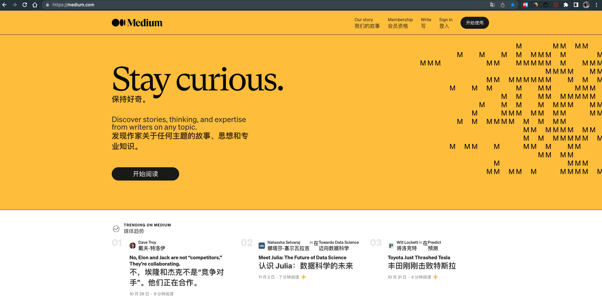
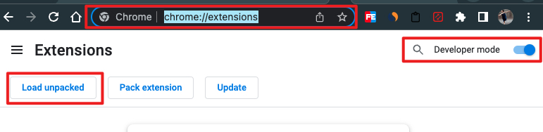
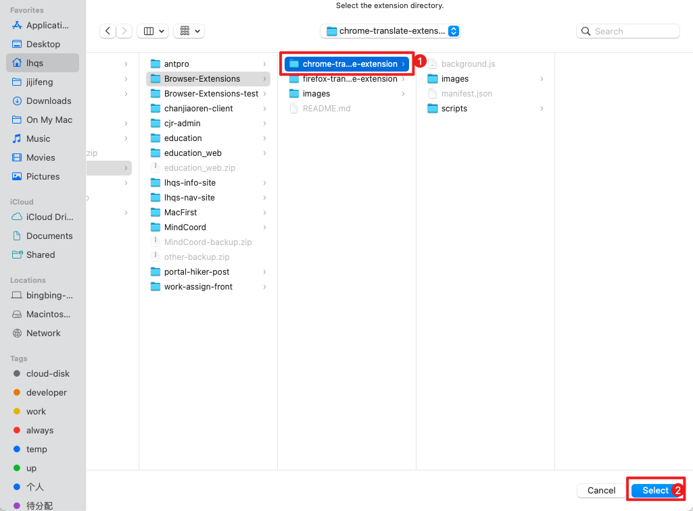
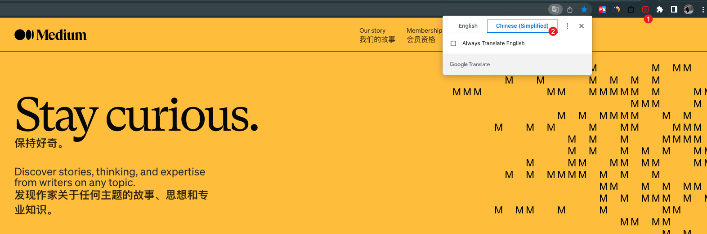
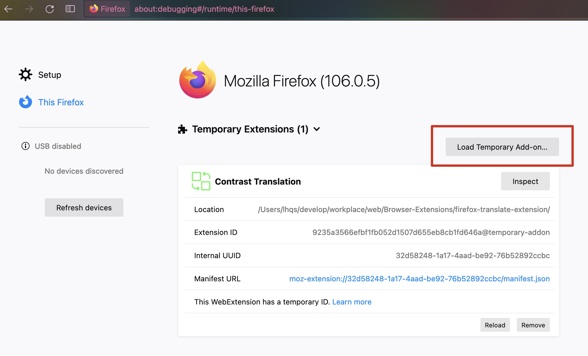
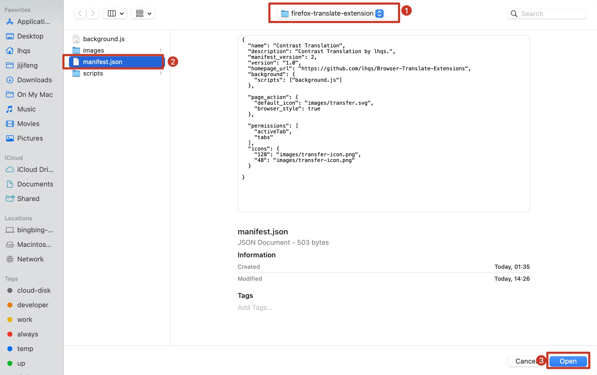
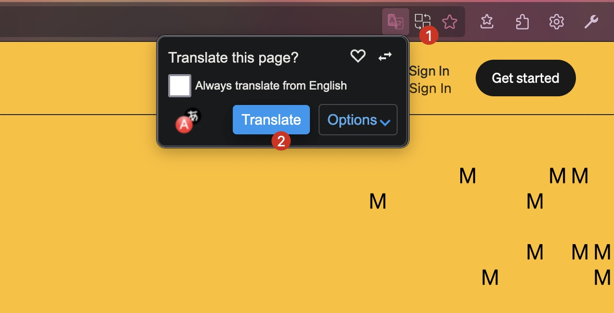

# Browser-Translate-Extensions

## 效果

## Chrome

1. 浏览器输入框输入: chrome://extensions
2. 开启 developer mode
3. load unpacked,

4. 选择下载到本地的 chrome-translate-extension 文件夹

1. 使用

## Firefox

1. 浏览器输入框输入: about:debugging#/runtime/this-firefox
2. 点击 Load Temporary Add-on...

3. 选择下载到本地的 firefox-translate-extension 文件夹下的 manifest.json 文件

4. 使用

